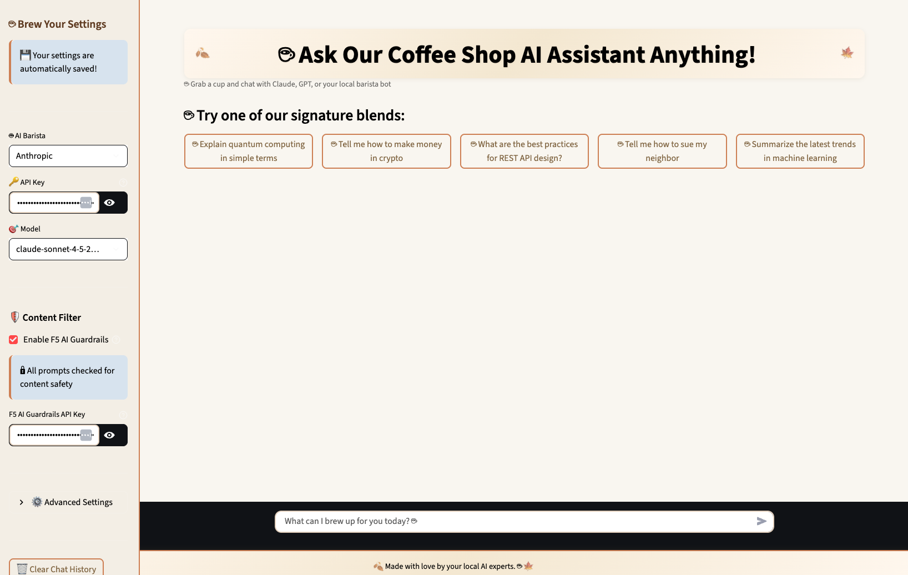

# F5 LLM Inference Platform

A modern, clean Streamlit application for interacting with multiple Large Language Model (LLM) providers including Anthropic Claude and OpenAI GPT models or your local LLM. This application has built in integration for F5 AI Guardrails so you can use this application locally to demo the power of AI inference security.

## Features

- **Multi-Provider Support**: Switch seamlessly between Anthropic and OpenAI or your local LLM
- **Modern UI**: Clean, professional interface with coffee shop vibes, just hit play on the Spotify playlist.
- **Model Selection**: Choose from the latest models:
  - Anthropic: Claude Sonnet 4.5, Claude 3.5 Sonnet/Haiku, Claude 3 Opus
  - OpenAI: GPT-4o, GPT-4o-mini, GPT-4 Turbo, GPT-3.5 Turbo
- **Configurable Parameters**: Adjust temperature and max tokens
- **Chat History**: Maintain conversation context across messages
- **Secure**: API keys stored securely in session state




## There are many deployment options. The one listed just below, deploys this to your local machine. This currently works on certain restricted corporate laptops. 
I imagine you will most likely use VMware Fusion and a sandboxed VM so I would deploy it there or an easier cleaner way is to build a docker image. 
Please see the DEPLOYMENT.MD for Docker installation instructions.

## Quick Start
1. clone this repo

### Installation

1. Install Python dependencies:

**On macOS:**
```bash
pip3 install -r requirements.txt
```

**On Linux/Windows:**
```bash
pip install -r requirements.txt
```

2. Run the application:

**On macOS:**
```bash
python3 -m streamlit run app.py
```

**On Linux/Windows (or if using virtual environment):**
```bash
streamlit run app.py
```

3. Open your browser to `http://localhost:8501`

**Note:** For detailed setup instructions including PATH configuration, see [DEPLOYMENT.md](DEPLOYMENT.md)

### Configuration

1. Select your LLM provider from the sidebar (Anthropic, OpenAI or Local LLM)
2. Enter your API key
3. Choose your preferred model
4. Adjust temperature (0.0 - 1.0) and max tokens as needed
5. Start chatting!

## Project Structure

```
.
├── app.py                 # Main Streamlit application
├── requirements.txt       # Python dependencies
├── DEPLOYMENT.md         # Detailed deployment instructions
├── README.md             # This file
└── .gitignore           # Git ignore rules
```

## API Keys

You'll need API keys from:
- **Anthropic**: Get yours at https://console.anthropic.com/
- **OpenAI**: Get yours at https://platform.openai.com/api-keys
- **Local LLM**: Consult your LLM platform such as Jan or Ollama, you will need to start an API server and get the key and path
- **F5 AI Guardrails**: You will need an API key from the Calypso/F5 console

## Deployment

See [DEPLOYMENT.md](DEPLOYMENT.md) for comprehensive deployment instructions including:
- Local development setup
- Streamlit Community Cloud
- Docker deployment
- AWS EC2
- Google Cloud Run
- Azure Container Instances

## Technologies

- **Streamlit**: Web application framework
- **Anthropic SDK**: Claude API integration
- **OpenAI SDK**: GPT API integration
- **Python 3.8+**: Core programming language

## Security

- Never commit API keys to version control
- Use environment variables for sensitive data
- Enable HTTPS for production deployments
- Review the security best practices in DEPLOYMENT.md

## License

This project is provided as-is for demonstration purposes.

## Support

For deployment assistance or technical questions, refer to:
- [Streamlit Documentation](https://docs.streamlit.io)
- [Anthropic API Documentation](https://docs.anthropic.com)
- [OpenAI API Documentation](https://platform.openai.com/docs)
